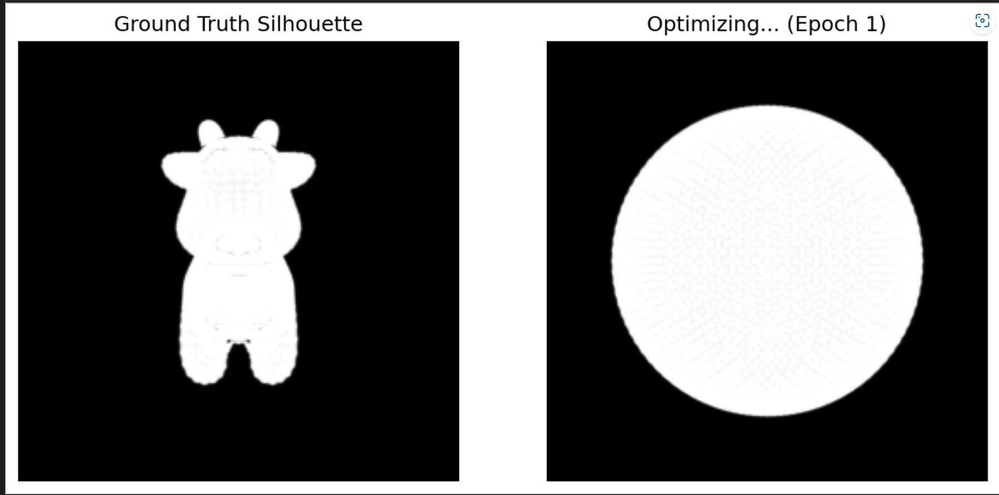
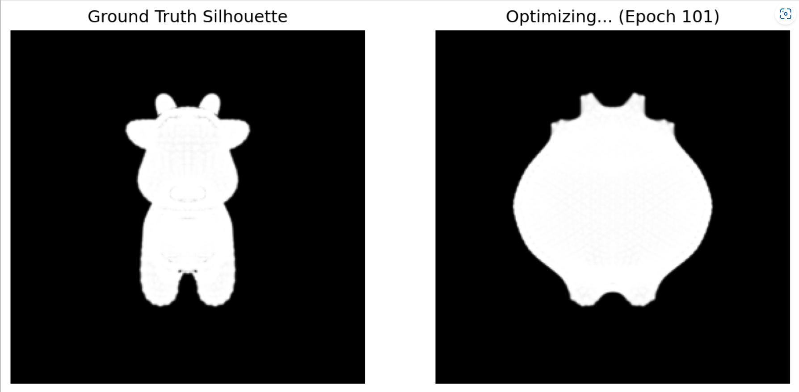
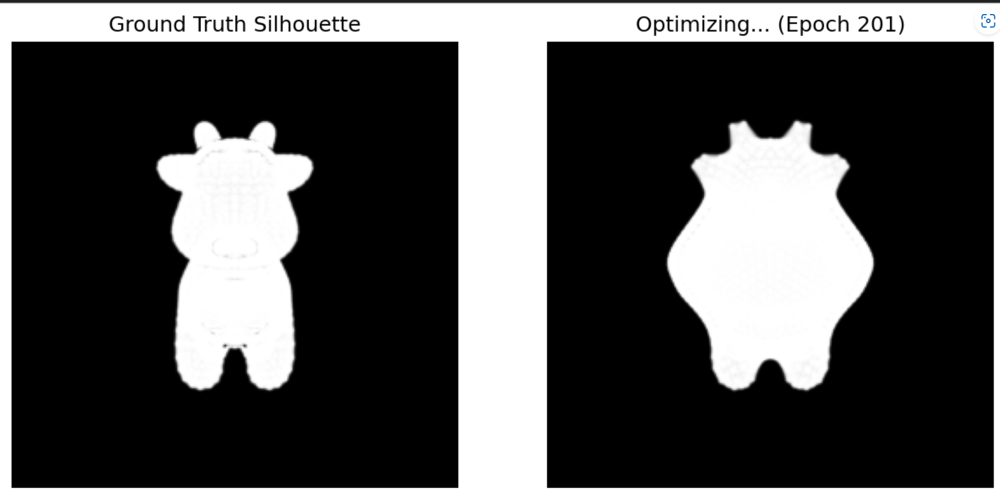
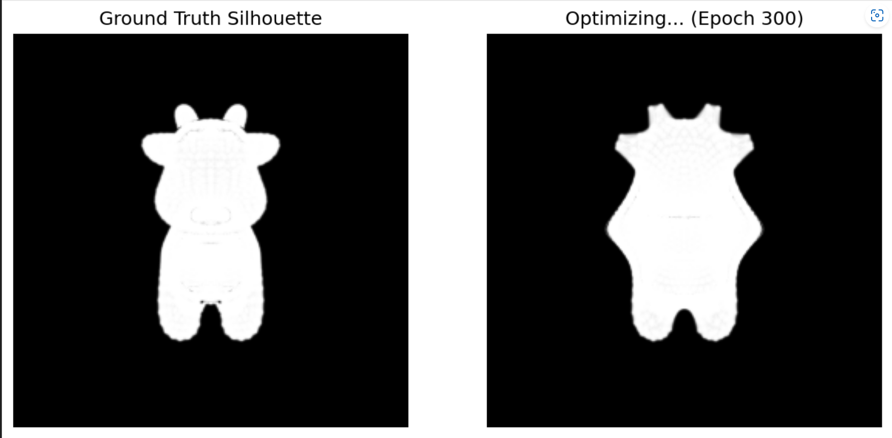
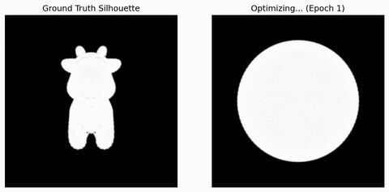

# 可微光栅化网格重建实验
苏文丽202411081022
## 项目简介
基于PyTorch3D实现软光栅化可微渲染，以球体网格为初始模型，通过多视角剪影监督+正则化损失梯度下降优化，重建奶牛三维网格。

## 实验目标
- 掌握软光栅化原理，理解离散网格边界平滑近似方案，解决梯度消失问题
- 学习利用多视角二维剪影图像反向优化三维网格顶点坐标
- 理解网格正则化作用，避免优化时网格拓扑崩坏、陷入局部最优

## 实验原理
### 1. 软光栅化 Soft Rasterization
传统硬光栅化边界阶跃变化会造成梯度消失。软光栅化通过像素到三角面片距离+Sigmoid生成平滑权重：
$$A(d) = \text{sigmoid}\left(\frac{d}{\sigma}\right)$$
$\sigma$ 控制边缘模糊，边界外仍保留有效梯度引导顶点更新。

### 2. 网格正则化损失
仅剪影损失易使网格扭曲重叠，引入三项正则约束保证网格平滑：
1. 拉普拉斯平滑：抑制表面尖锐凸起
2. 边长惩罚：约束三角面片拉伸/压缩
3. 法线一致性：维持相邻面片法向平滑

总损失函数：
$$L_{total} = L_{silhouette} + w_{lap}L_{lap} + w_{edge}L_{edge} + w_{normal}L_{normal}$$

## 实验任务与步骤
1. **环境配置**
安装 torch、torchvision、pytorch3d；Windows推荐conda安装。
2. **生成参考剪影**
加载奶牛目标网格，多视角相机渲染目标剪影图。
3. **初始化渲染管线**
高细分球体作为初始网格，构建软剪影光栅渲染器。
4. **可微优化循环**
顶点形变参数开启梯度；计算剪影MSE损失并叠加三类正则项；Adam/SGD反向更新顶点。
5. **过程可视化**
输出球体逐步形变至奶牛的中间重建效果。

## 重建效果展示
初始球体：

迭代100步效果：

迭代200步效果：

迭代300步最终重建效果：

可调节正则权重、软光栅$\sigma$、学习率等参数，优化网格重建平滑度与精度。

## 联合纹理优化
### 基础现状
原有实验仅依靠黑白剪影损失优化模型网格形状，缺少色彩与光照约束，还原效果单一。

### 拓展方案
引入 SoftPhongShader 可微着色器，构建多目标联合优化：
1. 损失项组合：同时拟合剪影轮廓 + 输入RGB真实图像
2. 联合优化变量：网格顶点坐标 + 顶点颜色（或纹理贴图）
3. 渲染管线：网格 → 可微Phong光照着色 → 生成预测RGB图
4. 优化目标：最小化预测图与原图RGB差值 + 剪影轮廓误差

### 实现要点
- 使用 SoftPhongShader 计算局部光照，还原物体明暗、高光色彩特征
- 同步更新几何顶点位置与纹理/顶点色彩参数，几何、纹理联合收敛
- 双损失加权平衡轮廓精度与色彩还原度，提升重建真实感

  

## 环境依赖
- Python 3.8+
- torch, torchvision
- pytorch3d
